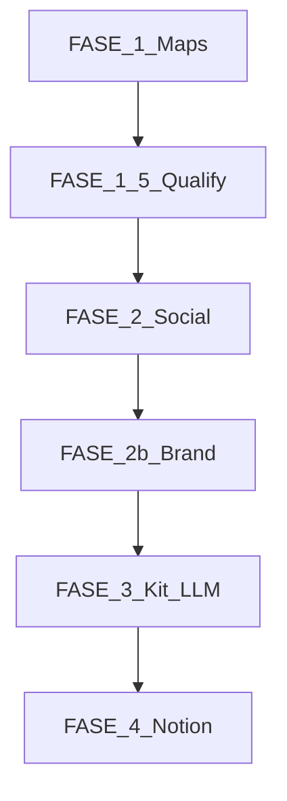

# Lógica de cada paso — Investigador de Prospectos

Referencia detallada de **qué hace cada FASE**, qué archivos intervienen, qué sale en disco/Notion y qué pasa si algo falla.

---

## Vista general



Orquestador: [`preparador.js`](../preparador.js).

---

## FASE 1 — Scrape Google Maps

**Objetivo:** Obtener candidatos locales (nombre, dirección, teléfono, web Maps, rating).

| | |
|---|---|
| **Entrada** | `LEADS_PER_DAY`, `SEARCH_MODE`, `lib/rotacion.js` (5 nichos Lima) |
| **Proceso** | Playwright abre Maps, busca por query, entra a cada ficha |
| **Filtro rápido** | `qualifyFast()` en [`lib/qualify.js`](../lib/qualify.js) + [`data/chains.json`](../data/chains.json) — descarta cadenas (H&M, Smart Fit, dominios corporativos) |
| **Salida** | Lista en memoria; backup parcial en `data/leads_del_dia.json` |
| **Anti-repetición** | [`lib/memoria.js`](../lib/memoria.js) lee `OBSIDIAN_DB_DIR/_registro_prospectos.json` |

**Fallbacks:** timeout Maps → recicla pestaña / reinicia sesión ([`lib/scraper.js`](../lib/scraper.js)). Pocos resultados → oversample `QUALIFY_OVERSAMPLE`.

**No usa LLM.**

---

## FASE 1.5 — Calificación web

**Objetivo:** Decidir si el lead vale la pena (score 0–100) antes de gastar redes/LLM pesado.

| | |
|---|---|
| **Entrada** | Candidatos FASE 1 con `website_url` o tier `no_web` |
| **HTTP** | `auditWebsite()` — fetch home, señales (ecommerce, web grande, sin web) |
| **LLM borderline** | `qualifyWithGemini()` → router `audit` o `longcontext` (HTML > 8 KB) |
| **Cadena audit** | Cerebras → Cohere → … → Gemini → AI21 → **SambaNova al final** ([GUANTELETE_ROLES.md](GUANTELETE_ROLES.md)) |
| **Umbral** | `QUALIFY_MIN_SCORE` (default 65) — debajo → `data/skipped_YYYYMMDD.json` |
| **Salida** | `opportunity_score`, `gaps`, `pitch_angle`, `tier`, `llm_meta` |

**Fallbacks:** sin API LLM → solo heurísticas HTTP. 429 en todos → `quotaSkipQualifyGemini` y sigue con score HTTP.

---

## FASE 2 — Redes e Instagram

**Objetivo:** Teléfono extra (FB/IG) y galería de fotos reales.

| | |
|---|---|
| **Entrada** | Leads que pasaron 1.5 |
| **Chrome** | Perfil **cuy** (`CHROME_USER_DATA_DIR` + `CHROME_PROFILE_DIRECTORY`) — **cerrar Chrome** antes |
| **Proceso** | `enrichFromSocial()` + `enrichInstagramGallery()` en [`lib/scraper.js`](../lib/scraper.js) |
| **Salida** | `lead.social`: `instagram_handle`, `bio`, `post_images`, `gallery` (hasta 8 URLs) |

**Fallbacks:** IG privado / login / rate limit → sin galería; FASE 3 usa logo Maps + stock por rubro.

---

## FASE 2b — Logo y color de marca

**Objetivo:** `logo_url` y `brand_primary` antes del copy.

| | |
|---|---|
| **Proceso** | `enrichBrandAssets()` — visita web del negocio, extrae logo |
| **Color** | [`lib/brand.js`](../lib/brand.js): reglas por nombre (Baransu → naranja `f97316`) + visión Gemini (`vision`) |
| **Prioridad color** | `brandLocked` por nombre > visión logo > hash local |

**Fallbacks:** sin logo → sin `logo=` en URL. Gemini 429 → color por nombre/hash.

---

## FASE 3 — LLM, Brand Kit y Maqueta URL

**Objetivo:** Manifest JSON + link corto `?kit=slug` para la factoría.

| | |
|---|---|
| **Copy hero** | `evaluateWithGemini()` → router `copy` (Gemini → GitHub → Cohere → Cloudflare → Groq) |
| **Kit** | `buildBrandKit()` + `finalizeBrandKit()` en [`lib/brandKit.js`](../lib/brandKit.js) |
| **Secciones** | router `sections` — planes, testimonios (mín. 6), stats |
| **Imágenes** | `rehostGalleryToBlob()` en [`lib/imageRehost.js`](../lib/imageRehost.js) si hay `BLOB_READ_WRITE_TOKEN` |
| **Publicar** | [`lib/kitStorage.js`](../lib/kitStorage.js): Blob > Supabase > copia `Plantillas-Web-Maestra/public/kits/` |
| **URL** | [`lib/urls.js`](../lib/urls.js) `buildMaquetaUrl({ kitSlug })` → `FACTORIA_BASE_URL/?kit=...&wa=...` |
| **Salida** | `data/kits/{slug}.json`, `lead.maqueta_url`, `lead.kit_slug` |

**Fallbacks:** LLM agotado → `sectionsCopy` por defecto en `brandKit.js` + copy local en `brand.js`. Sin Blob → kit local + estático en Plantillas para `npm run dev`.

**Verificación web (Maps sin sitio):** búsqueda Google `"nombre" Lima sitio web`. Si dominio coincide con el negocio → **descartar** (`web_confirmada_google`). Si no hay web propia en resultados → **candidato** confirmado.

**Retención Blob (producción):** Kits/maquetas y assets en Vercel Blob tienen **TTL estricto de 10 días** (plan Hobby). Demo expira si no hay respuesta del prospecto. Purga: [`lib/blobCleanup.js`](../lib/blobCleanup.js), `npm run limpiar-blob`, inicio de `preparador.js` e `Investigador.bat`. `BLOB_TTL_DAYS`, `BLOB_CLEANUP_ON_RUN`.

**URL legacy:** si no hay `kitSlug`, sigue existiendo URL larga con `pri`, `head`, `sec`, etc.

---

## FASE 4 — Notion CRM

**Objetivo:** Insertar prospectos en base **4. CRM Prospección**.

| | |
|---|---|
| **Proceso** | [`lib/notion.js`](../lib/notion.js) — dedup por nombre, propiedades flexibles |
| **Campos** | Maqueta URL, WhatsApp, Nicho, Score, diagnóstico con `Kit: {slug}` |
| **Dry-run** | `node preparador.js --dry-run` — no escribe Notion |

**Fallbacks:** sin columna URL → link en cuerpo de página Notion.

---

## Factoría (Plantillas) — cómo consume el kit

1. Usuario abre `?kit=baransu-gym-20260603`.
2. [`fetchBrandKit()`](../Plantillas-Web-Maestra/src/lib/kit.ts): CDN Blob (`VITE_KIT_CDN_BASE`) → `/kits/` estático → `/api/kit/`.
3. `applyKitTheme()` + fuentes Google + templates leen `sectionsCopy`.

Deploy factoría: **solo** `git push origin main` en Plantillas (Vercel sincroniza desde GitHub). Ver [COMANDOS_PUSH.md](COMANDOS_PUSH.md).

---

## Scripts de prueba

```bash
node scripts/audit-chains.js    # cadenas REJECT/OK
node scripts/pilot-brand-kit.js # checklist Baransu offline
npm run limpiar-blob            # purga Blob >10d
npm run purgar-data             # vacía data/ (reset pruebas)
```

---

## Documentos relacionados

- [HANDOFF_COLABORADOR.md](HANDOFF_COLABORADOR.md) — contrato URL y Guantelete
- [COMANDOS_PUSH.md](COMANDOS_PUSH.md) — git push desde tu red
- [Requisitos.md](Requisitos.md) — credenciales
