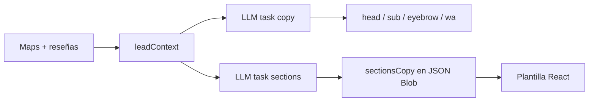

# Plan: APIs Guantelete y copy personalizado (para aprobación)

## Problema que viste (ej. WIESTATE)

1. **Plantilla equivocada:** inmobiliarias caían en `corporativo` con layout **holding** (LATAM, +500 colaboradores, portafolio genérico).
2. **Bug crítico (ya corregido):** `finalizeBrandKit` llamaba `generateSectionsCopy` con argumentos mal ordenados → el LLM **casi nunca** escribía `sectionsCopy`; solo quedaban defaults locales.
3. **Validación débil:** no se bloqueaba copy de multinacional en español corporativo vacío.

---

## Para qué sirve cada API hoy (estado real)

| API | ¿Se usa? | Tarea router | Qué genera |
|-----|----------|--------------|------------|
| **Gemini** | Sí | `vision`, `copy` | Colores desde logo + headline/subhead/eyebrow/wa (FASE 3) |
| **GitHub Models** | Sí (si hay token) | `copy`, `sections` | Respaldo hero + **texto de secciones del kit** |
| **Cohere** | Sí | `audit`, `sections` | Calificar lead (JSON) + **secciones kit** |
| **Cerebras** | Sí | `audit`, `copy`, `sections` | Calificar + respaldo copy/secciones |
| **Cloudflare AI** | Sí (si hay account+token) | todas | Fallback cuando otros dan 429 |
| **Groq** | Solo si `GROQ_API_KEY` | `audit`, `copy`, `sections` | Opcional — muchas cuentas sin key |
| **AI21** | Sí | `longcontext` | HTML largo del sitio del lead (FASE 1.5) |
| **SambaNova** | Último recurso | final de cadena | Solo si todo lo demás falló |
| **OpenRouter / Mistral** | Opcional | fallback | Solo si configuraste key |

**No usan LLM:** Maps scrape, Google verify, Instagram (Playwright/cuy).

---

## Flujo de texto en una maqueta (después del fix)



- **Paso A — Hero (`task: copy`):** Gemini primero; si 429 → GitHub → Cohere → … Rotación hasta 8 intentos si el texto es genérico (`copyQuality.js`).
- **Paso B — Secciones (`task: sections`):** GitHub → Cohere → Cloudflare → … Prompt **por plantilla** (`lib/copyPrompts.js`): inmobiliarias pide propiedades con distrito y precio; corporativo prohíbe holding.
- **Paso C — Factoría:** Lee `?kit=slug` del Blob; pinta `InmobiliariasTemplate` u otra con `sectionsCopy` del kit.

---

## Cambios hechos en este entregable

| Cambio | Efecto |
|--------|--------|
| Plantilla **`inmobiliarias`** (7.ª) | UI premium oscuro/dorado; ya no usa holding corporativo |
| Fix `generateSectionsCopy` | Los 7 proveedores pueden escribir secciones otra vez |
| `copyPrompts.js` + filtros holding | Textos atados a Maps, reseñas, bio IG, nombre |
| Default `corporativo` sin `stats_holding` | Consultoras ya no parecen grupo LATAM por defecto |

---

## Plan propuesto (fases — aprueba qué sí)

### Fase A — Ya hecho ✅
- Plantilla inmobiliarias + routing desde Roberto.
- Bug sections + anti-copy holding.

### Fase B — Siguiente corrida (recomendado)
1. Correr `Roberto.bat` con tus keys cargadas.
2. En consola buscar: `Kit secciones OK: github/...` o `cohere/...`.
3. Abrir maqueta inmobiliaria y validar propiedades con distrito + texto en “Sobre nosotros”.

### Fase C — Si aún sale genérico (opcional)
| Idea | Costo API | Beneficio |
|------|-----------|-----------|
| Segunda pasada `copy` solo si `sections` falló | +1 req/lead | Hero y secciones siempre de LLM |
| Pasar `review_snippets` completos (no solo keywords) | +tokens | Más detalle de la empresa |
| `task: copy` forzar Cohere en inmobiliarias (primero en cadena) | Cohere quota | JSON más estable en listas |
| Log en Notion: `LLM: github/sections` | $0 | Saber qué API escribió cada kit |

### Fase D — No hacer (por ahora)
- Usar las 7 APIs en **cada** lead “por rotar” — desperdicia cuota.
- Scraping Instagram anónimo — acordado mantener cuy.

---

## Cómo comprobar que “sí usan” las APIs

```powershell
cd C:\Users\gabit\Documents\Git\CuyLabs\Investigador_Prospectos
node scripts/test-guantelete.js
```

En una corrida real, líneas esperadas:

```
   LLM [copy]: fallback → github/gpt-4o-mini
   Kit secciones OK: cohere/command-r-plus-08-2024
```

Si solo ves `Copy local` o `usando defaults locales` → falta key o todas en 429.

---

## Tu decisión

Marca qué apruebas:

- [ ] **A** — Probar con lo entregado (inmobiliarias + fix sections)
- [ ] **B** — Fase C: segunda pasada copy obligatoria
- [ ] **C** — Fase C: Cohere primero en inmobiliarias
- [ ] **D** — Registrar en Notion qué proveedor escribió el kit

*Última actualización: junio 2026*
